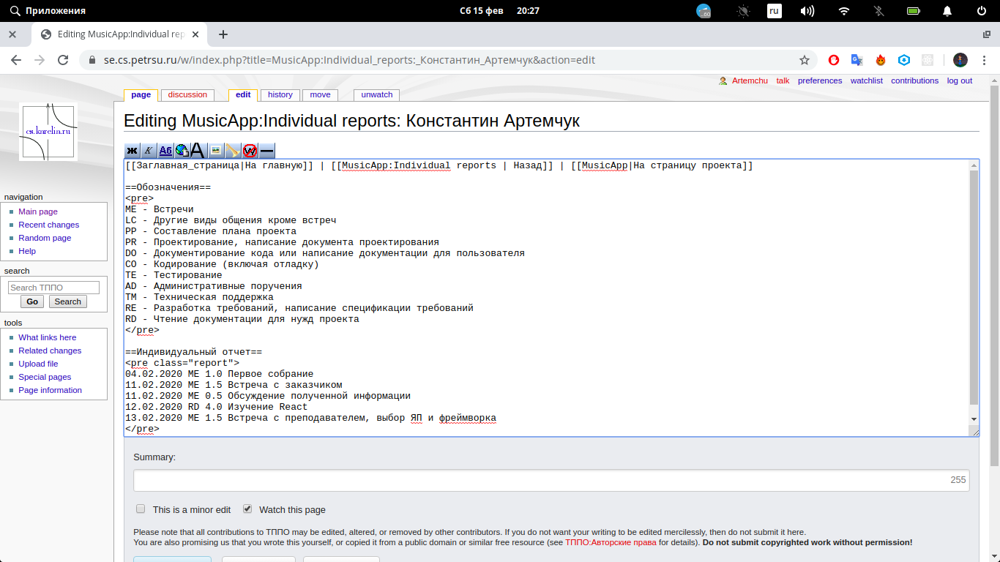
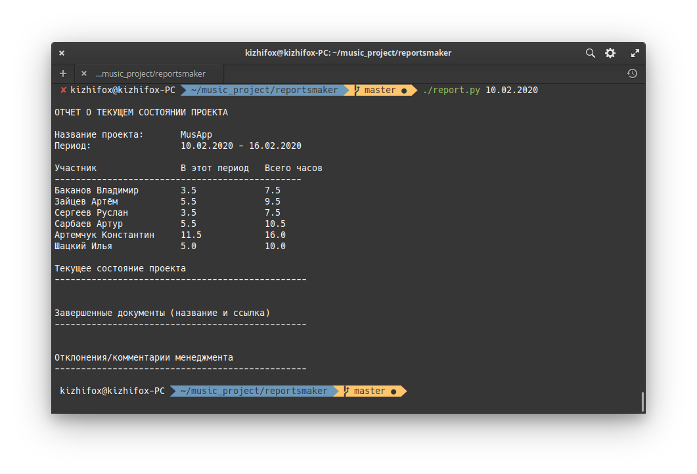
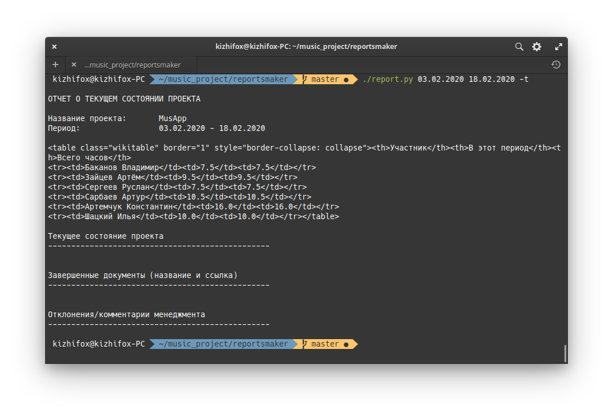

## Что это такое?

report - программа для автоматизации составления отчётов по курсу “Технология производства программного обеспечения” Петрозаводского государственного университета.

Программа берёт информацию со страницы проекта и генерируют отчёт о проделанной работе. Для этого требуется в файле [project_info.json](#project_info.json) указать название проекта, имена участников и URL адреса их индивидуальных отчётов и оформить отчёты участников проекта [в определённом формате](#report).

Использование:

```
report.py [-h] [-t] startDate [endDate]
```

Позиционные аргументы:

* `startDate` - начальная дата (дд.мм.гггг), обязательный аргумент
* `endDate` - конечная дата (дд.мм.гггг), по умолчанию = `startDate` + 6 (считает неделю)

Опциональные аргументы:

* `-t, --table` - вывод в виде HTML таблицы для вставки на Wiki
* `-h, --help` - показать справку

Для работы требует установленный модуль Beautiful Soup. Установка:

```
pip install BeautifulSoup4
```

<a name="report">Индивидуальный отчёт</a> должен быть заключён в тег `<pre class="report"> </pre>`, записи в нём должны иметь формат `дд.мм.гггг. ВД ч.ч комментарий`,  где `ВД` - вид деятельности, `ч.ч` - потраченное время в часах.

Предлагаемый список аббревиатур для видов деятельности: http://cs.petrsu.ru/studies/se/doc-templates/wh-abbrev.txt

Пример правильно оформленного индивидуального отчёта:

```html
<pre class="report">
04.02.2020 ME 1.0 Первое собрание
11.02.2020 ME 1.5 Встреча с заказчиком
11.02.2020 ME 0.5 Обсуждение полученной информации
12.02.2020 RD 4.0 Изучение React
13.02.2020 ME 1.5 Встреча с преподавателем, выбор ЯП и фреймворка
</pre>
```

Оформление отчёта на https://se.cs.petrsu.ru/:



### project_info.json

Файл, в котором хранится информация о проекте.

* `projectName`: строка - название проекта

* `members`: массив - информация об участниках проекта

Формат записи в массиве `members`:

* `memberName`: строка - имя участника

* `reportURL`: строка - URL индивидуального отчёта участника

Для примера файл заполнен данными из нашего проекта.

### Пример работы программы

Запуск программы с одним аргументом - начальной датой, вывод - неделя после неё:



Запуск программы с указанием начальной и конечной даты и выводом в виде HTML таблицы:



### //TODO

1. Добавить возможность генерации отчётов о человеческих ресурсах проекта. Примерная дата: конец апреля - начало мая 2020 года.